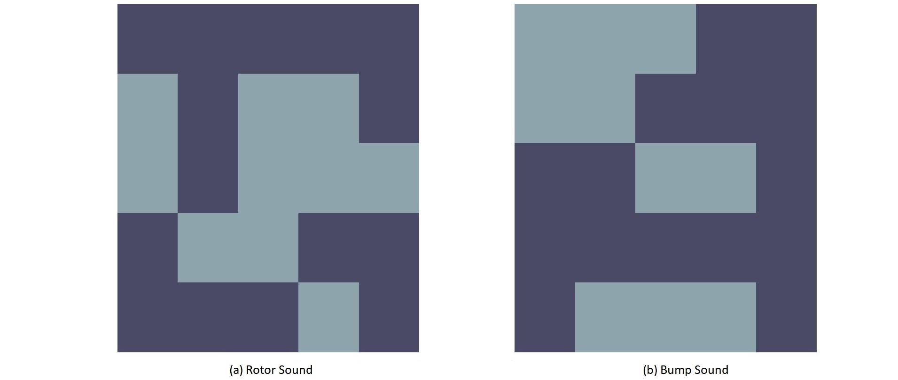

 

# Agent-Tracking

> Tracking an embodied AI agent to estimate movement from observations

Table of Contents
=================

* [Introduction](#introduction)
* [Problem](#problem)
* [Results](#results)
* [Author](#author)
* [License](#license)

## Introduction

This project was done as an assignment for the Spring 2019-20 course `COL864 - Learning/AI for Cognitive Robot Intelligence` taught by Prof. Rohan Paul at IIT Delhi. Primary theoretical resources were from `Artificial Intelligence: A Modern Approach`

## Problem

* This problem concerns tracking an agent (an underwater vehicle) exploring a lake. The robot is submerged at a particular depth and not visible on the surface. Our goal is to estimate the agent’s movement via an immersed acoustic receiver in the lake.
* We assume a discrete world and discretize the lake as a 2D grid of 5×5 grid. The robot can take 4 discrete actions of moving forward, backwards, left or right to an adjacent grid locations and these movements are equally likely within the grid.
*As the agent moves around in the lake it may encounter rocks emitting a bump sound. Further, the agent emits sound from its rotors that is heard by the receiver.
* The receiver can distinguish the two types of sounds (bump or rotor) and records the presence or absence of these sounds at each time instant. The likelihood of measuring the presence or absence of the rotor or bump sounds at each time step is stochastic and depends on local conditions in the lake.
* The spatial likelihood of hearing (observing) a bump sound or a rotor
sound at each time step was represented as a binary grid. The likelihood of
hearing the two types of sounds can be considered independent.

Following image is the 

*The spatial likelihood of hearing the presence or absence of a rotor
sound (left) or a bump sound (right) over the 5 × 5 grid. The light squares
represent probability 0.9 and dark square represents 0.1.*

For more details refer to [problem_statement](problem_statement.pdf)

## Results

*This is the transistional model for the 5x5 grid*

On this, given the observation sequence, we had to estimate the agent's location (across multiple tasks)

The tasks included filtering, smoothing, most-likely path prediction. We modelled this environment for 2 grid sizes (5x5 and 25x25). The results are as follows (since we're using random, different seed values might result in slightly different results)

 

*Probability Likelihood(left) and Most Likely vs Ground Truth(right) for Filtering Task*

 

*Probability Likelihood(left) and Most Likely vs Ground Truth(right) for Smoothing Task*

*Future Likelihood*

For mode details refer to the [report](report.pdf)

## Author

**Nilaksh Agarwal**

* Website: [nilax97.github.io](https://nilax97.github.io/)
* Github: [@nilax97](https://github.com/nilax97)
* LinkedIn: [@nilaksh97](https://linkedin.com/in/nilaksh97)

## License
 
MIT License

Copyright (c) 2020 Nilaksh Agarwal

***